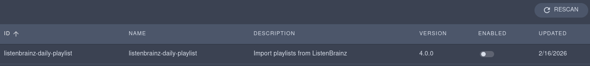
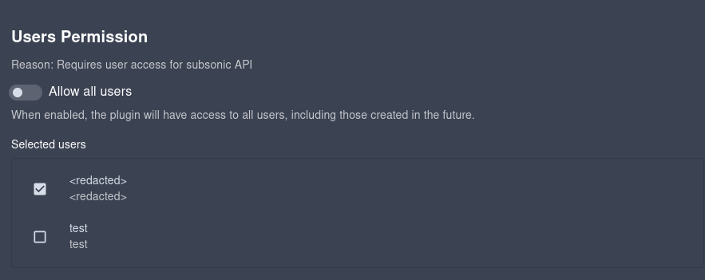

# Navidrome ListenBrainz Daily Playlist Importer

This repository contains a plugin for fetching daily playlists from [ListenBrainz](https://listenbrainz.org/)

## Requirements
1. Your library should have MBIDs for your tracks (or at least, most of them). This plugin does song lookups _only_ using MBID. For better fallback, having artist MBIDs will also help.
2. A ListenBrainz account per user you wish to fetch
3. If you want daily playlists (`daily-jams`), you should follow the [`troi-bot`](https://listenbrainz.org/user/troi-bot/) user
4. Navidrome >= 0.60.0. This reworked the plugin API. When upgrading to this version, you will need to install a new plugin. For older versions of Navidrome, see https://github.com/kgarner7/navidrome-listenbrainz-daily-playlist/tree/v2.0.4

## Install instructions

### From GitHub Release

You can download the `listenbrainz-daily-playlist.ndp` from the latest release.

### From source

Requirements:
- `go` 1.25
- [`tinygo`](https://tinygo.org/) (recommended)

#### Build WASM plugin

##### Using stock golang

```bash
make
```

This is a development build of the plugin. Compilation should be _extremely_ fast

##### Using TinyGo
```bash
make prod
```

This is the release build. Package will be smaller (and faster), but compilation will be slower.

### Install

Put the the `listenbrainz-daily-playlist.ndp` file in your Navidrome `Plugins.Folder`.

Make sure that:
1. You have plugins enabled (`Plugins.Enabled = true`, `ND_PLUGINS_ENABLED = true`).
2. Your Navidrome user has read permissions in the plugin directory

As an admin user open the plugin page (profile icon > plugins) and enable the `listenbrainz-daily-playlist` plugin.
Note that you will need to configure it before use.

### Configuration

To make the plugin useful, you will need to configure it.
This requires configuring one or more users, and specifying which playlists to use.

1. Navigate to the plugin list page (user icon > plugins) as an admin user. 
2. Click on plugin to enter the configuration page



3. Select which user(s) you want to be able to use this plugin, or allow all users.



4. Configure the plugin. You must have at least one user configuration (press the plus). If there are any errors in red in the configuration block, you must resolve them before saving.

- `User configurations`: a list (one or more) of users to configure. Each user configured in this list should be selected in the users permission block
    - `Navidrome username`: this is the username of the Navidrome account you want to enable. This user must also be selected in the `User Permission` block
    - `ListenBrainz username`: the user's ListenBrainz username
    - `ListenBrainz token`: optional, allows fetching information using the ListenBrainz token. This _may_ improve rate limit/be used in the future.
    - `Generate playlist`: if true, create a playlist by applying an algorithm based off of [Troi](https://github.com/metabrainz/troi-recommendation-playground). **CAUTION**: This is experimental, and will be slow, as track matching is expensive (upwards of 1000 requests per user generation)
        - `Generated playlist name`: the name of the generated playlist
        - `Exclude tracks played in the last X days`: if nonzero, exclude tracks that were played by this user in the last X days.
        - `Maximum number of tracks per artist`: if nonzero, allow at most X tracks from a given artist.
    - `Playlists to import`: a list of one or more playlist types to be imported
        - `Source`: This is a ListenBrainz internal field which specifies how the playlist is generated. Examples include `weekly-jams`, `daily-jams` and `weekly-exploration`.
        - `Playlist name to be imported`: the name of the playlist that will be created within Navidrome. **CAUTION**: if a playlist with this name already exists, it will be overridden.
    - `Extra playlists to import (by playlist ID)`: a list of additional playlists to import, using playlist ID
        - `ListenBrainz PLaylist ID`: the ID of the playlist. When visiting a playlist like `https://listenbrainz.org/playlist/00000000-0000-0000-0000-000000000000/`, the ID is the part of of the playlist between (excluding) `/playlist/` and the last `/` (in this example, `00000000-0000-0000-0000-000000000000`). Alternatively, if you export as JSPF, this is the last part of the playlist `identifier` field.
        - `Playlist name to be imported`: the name of the playlist that will be created within Navidrome.
    - `Include tracks with this rating.`: if you only want to import tracks with certain ratings, uncheck one or more boxes
- `Hour to fetch playlists (24-hour format)`: the hour (24-hour moment) to fetch/generate all playlists. This is then delayed by a random interval up to an hour
- `Fallback search count`: If a match isn't found by track name, how many tracks to search by until giving up. Between 1 and 500, inclusive
- `Check for out of date playlists on plugin start`: If Navidrome or the plugin is restarted, check if any playlists are out of date (at least three hours old).

![Image showing a full configuration. There is one user: ND username <redacted>; LBZ username lbz-username LBZ token uuidv4 of all zeros; generate playlist is true with name "Generated Daily Jams", excluding tracks played in the last 60 days, and allowing at most 2 tracks per artist. Two playlists are set to be imported, one is expanded with source "daily-jams" and name "ListenBrainz Daily Jams", and the other "weekly-jams" is not expanded. One playlist is to be imported by playlist ID, with a token UUID of all 0s. All ratings except 1 are selected, and the playlists are scheduled to be fetched around 7:00 AM, with a fallback search of 15 tracks. Plugin will check for out of date playlists on start](./assets/full_config.png)

To get another valid `source`, visit your `https://listenbrainz.org/user/<your username>/recommendations/`.
Click on the inspect playlist `</>` icon and use the string in `source_patch`.


